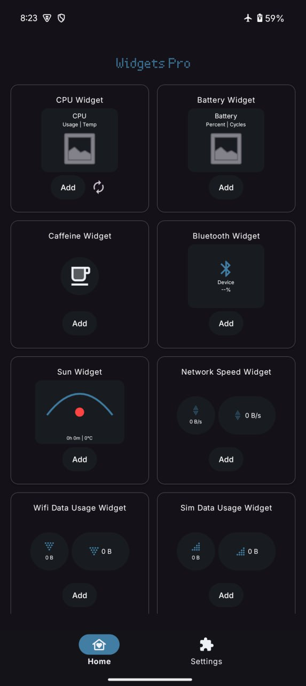
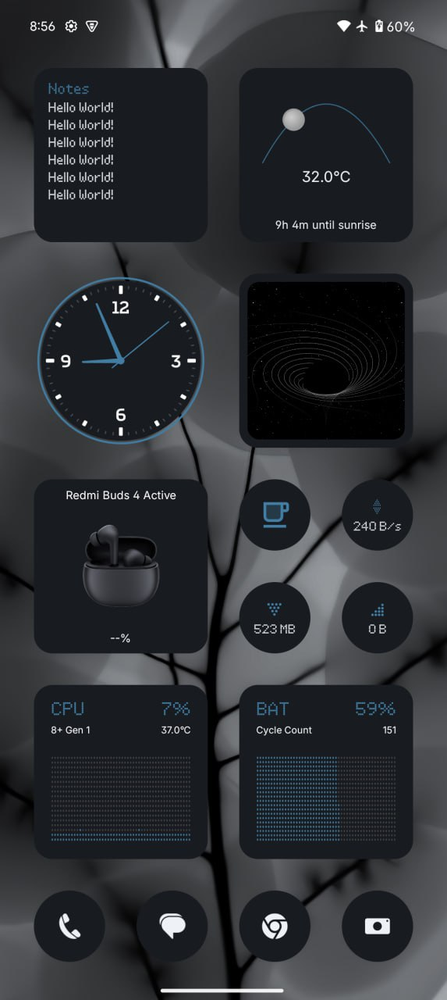

Inspired by a concept and newthings, I made this with Al's help to follow the same design language like nothing, because I daily drive it. I'm noob.
Took drawable resources from various apps

For support and discussion please use - https://t.me/widgets_pro

Currently the app support Android 14 and above. Will soon lower the android requirements.

## Screenshots

  
  &nbsp;&nbsp;&nbsp; <!-- adds visible space -->
  

